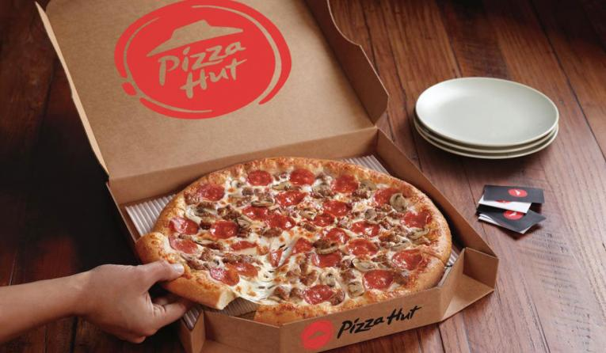

# Project1 TeamTasty - Fast Food Restaurants Analysis
A look into the Fast Food franchises of America and an analysis to determine the best location for next new Pizza Hut!

Hi, we are Team Tasty!  We will be exploring the fast food restaurants across the USA with the mission to not only find the most popular franchises per states, but also uncover what demographic and geographic factors are shared amongst the most popular restaurants. From our findings, we hope to provide insight that can help a newfound Pizza Hut franchise owner decide which location is the most likely to have high scoring Yelp ratings and reviews. 

We will be analyzing fast food restaurants’ popularity per state and comparing it to several factors including income, yelp reviews and other yelp interactions in that region.  The team plans on defining specific variables including average income per region, restaurant popularity based on frequency of yelp reviews, and average rating and hope to answer the following questions:

1. Do certain demographic factors contribute to a restaurant’s popularity and rating?
2. What restaurants are rated highest per region? 
3. What is Pizza Hut’s competition?
4. Where would be the best place to open a Pizza Hut?

 
 
---

Team Members: Aaron Sotelo, Brandie Limon, Dillon Davis, Tiffany Cheng

Powerpoint Presentation link: https://drive.google.com/file/d/1qx2k0oEDw7L390wSzWyGoMdMbedhBIuL/view?usp=sharing

Team Tasty Project Write-up: https://drive.google.com/file/d/12B3oISrkhmIh0DzxZ9CPS8hlD6jVNQPf/view?usp=sharing
